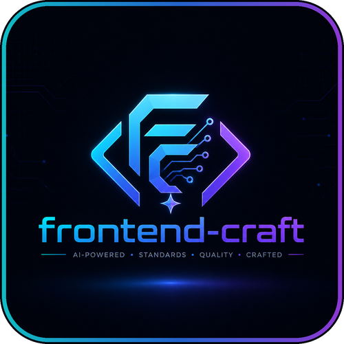

<div align="center">



# frontend-craft

### ひとつのツールキット。すべての AI コーディングアシスタント。本番品質のフロントエンド標準。

[](https://github.com/bovinphang/frontend-craft/stargazers)
[](https://github.com/bovinphang/frontend-craft/actions/workflows/ci.yml)
[](https://www.npmjs.com/package/@bovinphang/frontend-craft)
[](../../LICENSE)


**🌐 Language / 语言 / 語言 / 言語 / 언어**

[English](../../README.md) · [简体中文](../../README.zh-CN.md) · [繁體中文](../zh-TW/README.md) · [**日本語**](README.md) · [한국어](../ko-KR/README.md)

</div>

---

`frontend-craft` は、以下の **15 の AI コーディングアシスタント**に統一されたフロントエンドエンジニアリング標準をもたらす**汎用フロントエンドプラグイン**です：

`claude` `codex` `cursor` `windsurf` `opencode`
`kilo` `gemini` `copilot` `antigravity` `augment`
`trae` `codebuddy` `cline` `openclaw` `qoder`

各ランタイムのパスと注意事項は [`docs/runtimes/`](../runtimes/) にあります。

**13 の専門エージェント**、**45 の自動起動スキル**、**8 のスラッシュコマンド**、**5 のイベント駆動フック**、6 つのデザインツールエンドポイント向け **MCP 統合**、そして完全な**ルールライブラリ**をひとつのパッケージにまとめています。コマンドひとつ実行するだけで、チームのすべての AI セッションが React、Vue、Next.js、Nuxt を同じように書きます——型安全で、アクセシブルで、セキュアで、一貫性を持って。

---

## なぜ frontend-craft なのか？

| 課題                                                                          | frontend-craft の解決策                                                                                        |
| ----------------------------------------------------------------------------- | -------------------------------------------------------------------------------------------------------------- |
| AI アシスタントが一貫性のない、型なしの、安全でないフロントエンドコードを書く | **45 のスキル**がチーム標準をエンコード——該当ファイルに触れると自動起動                                        |
| AI ツールごとにプラグイン形式が異なる                                         | **ひとつの CLI** で同じルール、エージェント、フックを 15 のランタイムにインストール                            |
| デザインからコードへの受け渡しで情報が失われる                                | **MCP 統合**が Figma、Figma Desktop、Sketch、MasterGo、Pixso、墨刀からより豊富なデザインコンテキストを取り込み |
| レビューが場当たり的で浅い                                                    | **13 のエージェント**がグレード付きレポートを出力：コード、セキュリティ、a11y、パフォーマンス、TS、UI 忠実度   |
| 誰も lint やテストを実行するのを忘れる                                        | **イベント駆動フック**が保存時とセッション終了時に自動検証                                                     |
| 新規プロジェクトが毎回ゼロから始まる                                          | **`/fec-init`** が CLAUDE.md、ルール、設定を数秒でスキャフォールド                                             |

---

## インストール

**Node.js 22+** が必要です。**Windows、macOS、Linux** で動作します（すべてのフックとスクリプトは Node.js で実装）。

### 方法 1：fec CLI をグローバルインストール（推奨）

```bash
# 1. fec コマンドをグローバルにインストール
npm install -g @bovinphang/frontend-craft@latest

# 2. フロントエンドプロジェクトへ移動
cd your-project

# 3. 接続する AI ランタイムを対話的に選択
fec setup

# 4. 現在のプロジェクトに接続
fec setup codex
fec setup claude
fec setup all

# 5. グローバル接続、すべてのプロジェクトで利用
fec setup codex --global
fec setup claude --global
fec setup all --global

# 6. プレビュー / 確認
fec install --all --dry-run --global
fec list
```

`npm install -g` は `fec` ターミナルコマンドだけをインストールします。`fec setup` は frontend-craft をプロジェクトに接続するターミナル CLI コマンドで、AI アシスタント内の `/fec-init` スラッシュコマンドとは別です。対話型ターミナルでは、引数なしの `fec setup` が runtime の選択を求めます。`fec setup <runtime>` と `fec setup all` は既定で現在のプロジェクトに接続します。`--global` を渡した場合だけ、選択した AI ツールのグローバル設定ディレクトリに接続され、すべてのプロジェクトで利用できます。

### 方法 2：npx で一時実行（グローバル fec 不要）

```bash
# 1. 対話ウィザード
npx @bovinphang/frontend-craft@latest

# 2. 現在のプロジェクトに接続
npx @bovinphang/frontend-craft@latest install --local codex
npx @bovinphang/frontend-craft@latest install --local claude
npx @bovinphang/frontend-craft@latest install --all --local

# 3. グローバル接続、すべてのプロジェクトで利用
npx @bovinphang/frontend-craft@latest install --global codex
npx @bovinphang/frontend-craft@latest install --global claude
npx @bovinphang/frontend-craft@latest install --all --global

# 4. プレビュー / 確認
npx @bovinphang/frontend-craft@latest install --all --dry-run --global
npx @bovinphang/frontend-craft@latest list
```

グローバルな `fec` コマンドをインストールしたくない場合は `npx` を使います。引数なしでは対話ウィザードを開きます。まず 1 つ以上のランタイムを選択し、次にグローバルまたは現在のプロジェクトへ接続するかを決定します。すべての runtime をスクリプトでインストールする場合は `install --all --local` または `install --all --global` を使い、`install all` とは書きません。CI / スクリプト環境では常に `--global` / `-g` または `--local` / `-l` を指定してください。TTY でなく未指定の場合、CLI は `claude --global` をデフォルトとします。

### 方法 3：Claude Code Marketplace

Claude Code ユーザーには、**Claude Code Marketplace** からの单一ソースでのインストールを推奨します。CLI を Claude 用に使うのは、クロスランタイムインストール、スクリプト/オフラインのファイルコピー、または非 Marketplace 環境の場合に限ってください。

Marketplace が既にインストールされている場合、CLI は `--force` を付けても 2 つ目の Claude コピーをインストールまたはアップデートしません。代わりに Claude Code Marketplace からアップデートしてください。他のスコープに CLI 管理の Claude インストールが既に存在する場合、対話型ターミナルではそのソースを最新に保つか、アンインストールしてから切り替えるかを確認します。非対話型ターミナルでは停止し、実行すべき `update`、`uninstall`、`install` コマンドを正確に表示します。

完全な Claude 固有の手順は [docs/runtimes/claude.md](../runtimes/claude.md) · [简体中文](../runtimes/claude.zh-CN.md) にあります。

---

## クイックスタート

インストール後、すべての AI セッションで完全なフロントエンドエンジニアリングツールキットを利用できます：

```text
あなた："Review my recent changes"
→ fec-code-reviewer エージェントが起動し、reports/code-review-*.md を出力

あなた："/fec-review"
→ アーキテクチャ、型、レンダリング、スタイル、a11y の観点で構造化レビューを実行

あなた："この Figma リンクからチェックアウトページを実装して"
→ fec-figma-implementer エージェントが MCP 経由でデザインを読み取り、コンポーネントとレポートを出力

あなた："/fec-scaffold dashboard feature"
→ プロジェクト規約に従い page / feature / component のディレクトリツリーを作成

あなた："/fec-refactor-clean"
→ デッドコード、未使用 export、スタイル、依存関係を分類して安全に削除
```

以下のスラッシュコマンドは **Claude Code** を例に示しています。他のランタイムも各自のコマンドシステムで同等の機能を提供します（[`docs/runtimes/`](../runtimes/) を参照）。

---

## プロンプト例

シナリオ別の完全なプロンプト集は [docs/example-prompts.md](../example-prompts.md) を参照してください。

```text
あなた：「マージ前に最近の変更をレビューして。アーキテクチャ、型安全性、レンダリング挙動、スタイル、アクセシビリティ、足りないテストを重点的に見て。」
あなた：「コードを書く前に、アカウント請求機能を計画して。ルート構成、コンポーネント境界、データフロー、状態の所有、バリデーションフロー、リリースリスクを含めて。」
あなた：「複数ステップ登録フォームを作って。プロジェクトのフレームワークに合うフォームと schema バリデーションの方針を選び、ファイルアップロード、条件付きフィールド、非同期バリデーション、アクセシブルなエラーを含めて。」
あなた：「Figma ノード 123:456 に基づいて UI を実装して。既存の design token とコンポーネントを再利用し、余白とレスポンシブ状態を合わせ、前提も記録して。」
あなた：「`/fec-refactor-clean` このモジュールのデッドコードを整理して。」
```

---

## 内容

### コマンド

スラッシュコマンドは構造化ワークフローの主要なエントリーポイントです。ほとんどが `reports/` にタイムスタンプ付き Markdown レポートを出力します。

| コマンド              | 用途                                                                | レポート                                             |
| --------------------- | ------------------------------------------------------------------- | ---------------------------------------------------- |
| `/fec-init`           | プロジェクトテンプレート（CLAUDE.md、ルール、設定）を初期化         | —                                                    |
| `/fec-review`         | 指定または最近変更したファイルの構造化レビュー                      | `code-review-*.md`                                   |
| `/fec-scaffold`       | 規約に従い page / feature / component のボイラープレートを作成      | —                                                    |
| `/fec-plan`           | 統合計画：実装アーキテクチャまたはテスト戦略                        | `architecture-proposal-*.md` または `test-plan-*.md` |
| `/fec-tdd`            | 赤 → 緑 → リファクタリングのフロントエンド TDD ループ               | —                                                    |
| `/fec-debug`          | フロントエンド問題の診断と修復：ビルド、ランタイム、UI、API 障害    | `debug-*.md`                                         |
| `/fec-refactor-clean` | デッドコード、未使用 export、スタイル、依存関係を分類して安全に削除 | `refactor-clean-*.md`                                |
| `/fec-doc-sync`       | README、docs、環境変数、スクリプト、API/ルート説明、デプロイ文書を同期 | —                                                    |

### スキル（自動起動）

スキルはファイルパターン、フレームワーク、タスクコンテキストに基づいて**自動起動**するワークフロー定義です。レビュー観点、出力規約、レポート形式をエンコードしています。

以下のスキルはユースケース別に分類されているため、プロジェクト標準、実装、テスト、レビュー、デザイン、移行、プロジェクト進化、ドキュメント保守のワークフローをすばやく見つけられます。

**プロジェクト標準** — 該当フレームワークが検出されると自動適用：

| スキル                          | 範囲                                                                    |
| ------------------------------- | ----------------------------------------------------------------------- |
| `fec-react-project-standard`    | React + TypeScript（構造、コンポーネント、ルーティング、状態、API 層）  |
| `fec-vue3-project-standard`     | Vue 3 + TypeScript（構造、コンポーネント、ルーティング、Pinia、API 層） |
| `fec-nextjs-project-standard`   | Next.js 14+ App Router、SSR/SSG、ストリーミング、メタデータ             |
| `fec-nuxt-project-standard`     | Nuxt 3 SSR/SSG、Composition API、データ取得、ミドルウェア               |
| `fec-vite-project-standard`     | Vite 設定、環境変数安全性、HMR、開発プロキシ、ビルド最適化              |
| `fec-monorepo-project-standard` | pnpm workspace、Turborepo、Nx の構造とタスクオーケストレーション        |
| `fec-typescript-project-standard`   | TypeScript 設定、公開 API 型、宣言ファイル、DTO、ジェネリクス                |

**実装機能** — 特定のフロントエンド機能を構築する際に起動：

| スキル                    | 範囲                                                                         |
| ------------------------- | ---------------------------------------------------------------------------- |
| `fec-data-fetching`       | サーバー状態取得、キャッシュ、無効化、SSR、無限読み込み                      |
| `fec-api-integration`     | 型付き API client、認証 refresh、アップロード、リアルタイム統合              |
| `fec-state-management`    | 状態の所属、ストア選定、URL 状態、サーバー/フォーム/ローカル状態の境界       |
| `fec-form-handling`       | フレームワークに応じたフォーム選定、schema バリデーション、動的フィールド、アップロード |
| `fec-browser-storage`     | localStorage / sessionStorage / IndexedDB / Cookies の選定                   |
| `fec-route-protection`    | React Router、Next.js、Vue Router、Nuxt の認証・権限ルーティング             |
| `fec-pwa-implementation`  | マニフェスト、サービスワーカー、オフラインキャッシュ、インストールプロンプト |
| `fec-web-workers`         | Web Worker、Transferable、Comlink、ワーカープール                            |
| `fec-canvas-threejs`      | Canvas 2D、Three.js、React Three Fiber、WebGL                                |
| `fec-svg-animation`       | CSS / Framer Motion / GSAP SVG アニメーションと reduced-motion               |
| `fec-list-virtualization` | フレームワークに応じた大規模リスト仮想化、計測、グリッド、無限スクロール     |

**テスト** — フロントエンドテストの計画や作成時に起動：

| スキル                  | 範囲                                                            |
| ----------------------- | --------------------------------------------------------------- |
| `fec-testing-strategy`  | 静的、ユニット、コンポーネント、統合、E2E、視覚テストの階層選択 |
| `fec-component-testing` | React Testing Library / Vue Test Utils とリグレッションシナリオ |
| `fec-e2e-testing`       | Playwright / Cypress E2E と Page Object、CI 統合                |
| `fec-tdd-workflow`      | テストファーストのフロントエンド実装、赤緑リファクタリング      |

**レビューと品質** — レビュー、検証、クリーンアップ時に起動：

| スキル                         | 範囲                                                                          |
| ------------------------------ | ----------------------------------------------------------------------------- |
| `fec-code-review`              | アーキテクチャ、型、レンダリング、スタイル、a11y レビュー                     |
| `fec-debug-framework`          | ビルド、ランタイム、UI、API/データ障害の体系的な診断                          |
| `fec-security-review`          | XSS、CSRF、機密データ漏洩、入力検証                                           |
| `fec-accessibility-check`      | WCAG 2.2、キーボード、フォーカス、タッチ、スクリーンリーダー動作              |
| `fec-dependency-upgrade`       | 依存関係アップグレード、lockfile レビュー、CVE 修正、移行検証                 |
| `fec-validation-fix`           | lint、type-check、test、build を一度に実行して修復                            |
| `fec-performance-optimization` | Core Web Vitals、バンドル、レンダリング、メモリ、ネットワーク、予算レビュー   |
| `fec-refactor-clean`           | デッドコード、未使用 export、スタイル、ルート、依存関係の安全なクリーンアップ |

**デザイン UI** — デザイン実装、デザインシステム、視覚仕上げで起動：

| スキル                        | 範囲                                                                          |
| ----------------------------- | ----------------------------------------------------------------------------- |
| `fec-ui-design`               | プロダクト文脈に沿った UI 方向性、反テンプレート設計ダイヤル、メディア戦略、状態、ビジュアル QA |
| `fec-image-generation`        | 図表、画像生成/編集、ビジュアルアセット、PNG QA と修復ループ                  |
| `fec-drawio-studio`         | 編集可能な draw.io / diagrams.net 技術図、shape 検索、自動レイアウト、コード構造図 |
| `fec-web-video-presentation` | 記事、台本、レッスン、demo から録画可能な 16:9 step-driven Web プレゼンを作成 |
| `fec-tailwind-design-system`  | Tailwind token、テーマ拡張、variants、class 管理、ダークモード                |
| `fec-responsive-layout`       | モバイルファースト、container queries、データ密集 responsive UI               |
| `fec-motion-interaction`      | 文脈に応じた motion 強度、ページ遷移、スクロール animation、reduced-motion    |
| `fec-implement-from-design`   | デザインツール、スクリーンショット、または section 単位のビジュアル参照から UI を実装 |
| `fec-storybook-component-doc` | Storybook コンポーネント文書、デザインシステム表示、隔離状態プレビュー        |

**レガシー移行** — モダナイゼーション時に起動：

| スキル                           | 範囲                                                           |
| -------------------------------- | -------------------------------------------------------------- |
| `fec-legacy-web-standard`        | JS + jQuery + HTML のレガシープロジェクト開発・保守基準        |
| `fec-legacy-to-modern-migration` | レガシーフロントエンドのモダナイズ、ターゲットスタック選定、段階的ワークフロー |

**プロジェクト進化** — 参照システムをプロジェクトネイティブな改善として吸収する時に起動：

| スキル        | 範囲                                                               |
| ------------- | ------------------------------------------------------------------ |
| `fec-alchemy` | 参照システムの能力を独自のプロジェクトネイティブ設計として吸収 |

**ドキュメント保守** — ドキュメント作業時に起動：

| スキル                          | 範囲                                                               |
| ------------------------------- | ------------------------------------------------------------------ |
| `fec-backend-requirements-handoff` | Frontend-to-backend handoff for UI data needs, actions, states, rules, and questions |
| `fec-doc-sync`                  | フロントエンド文書をコード、設定、スクリプト、ルート、API、環境変数、デプロイ事実と同期 |
| `fec-source-driven-development` | プロジェクト事実と公式ソースでバージョン依存の判断を検証           |

### エージェント

エージェントはメインアシスタントから起動される専門サブエージェントで、特定のタスクに集中して構造化レポートを返します。

| エージェント                | 焦点                                                                                 | レポート                     |
| --------------------------- | ------------------------------------------------------------------------------------ | ---------------------------- |
| `fec-code-reviewer`         | React/Vue/Next/Nuxt、TS、スタイル、クライアント側セキュリティ（信頼度ベース）        | `code-review-*.md`           |
| `fec-typescript-reviewer`   | 型安全性、非同期の正しさ、慣用的パターン（レポートのみ）                             | `typescript-review-*.md`     |
| `fec-security-reviewer`     | XSS、クライアントシークレット、危険な DOM/API、CSP、依存関係監査                     | `security-review-*.md`       |
| `fec-performance-optimizer` | バンドルサイズ、レンダリングパフォーマンス、ネットワークボトルネック                 | `performance-review-*.md`    |
| `fec-architect`             | ページ分割、コンポーネントアーキテクチャ、状態フロー、ディレクトリ計画               | `architecture-proposal-*.md` |
| `fec-test-planner`          | リスク→階層マトリクス：静的、ユニット、コンポーネント、E2E、視覚、a11y、セキュリティ | `test-plan-*.md`             |
| `fec-debugger`              | ビルド、ランタイム、UI、API 障害の複雑なフロントエンド診断                           | `debug-*.md`                 |
| `fec-refactor-cleaner`      | 未使用コード、export、スタイル、ルート、依存関係の分類と安全な削除                   | `refactor-clean-*.md`        |
| `fec-e2e-runner`            | E2E 作成と実行（Playwright/Cypress）、flaky 隔離、トレース                           | `e2e-summary-*.md`           |
| `fec-doc-updater`           | README、ランタイムドキュメント、構造、機能表、メタデータの同期                       | —                            |
| `fec-ui-checker`            | 視覚的問題のデバッグとデザイン忠実度評価                                             | `ui-fidelity-review-*.md`    |
| `fec-figma-implementer`     | Figma/Sketch/MasterGo/Pixso/墨刀 デザインからの正確な UI 実装                        | `design-implementation-*.md` |
| `fec-design-token-mapper`   | デザイン変数をプロジェクトの Design Token にマッピング                               | `token-mapping-*.md`         |

### フック（イベント駆動）

フックは AI アシスタントのイベントで**自動実行**されます。呼び出し不要です。

| イベント                  | 動作                                                                                                  |
| ------------------------- | ----------------------------------------------------------------------------------------------------- |
| `SessionStart`            | Claude キャッシュをクリーンアップしてから、プロジェクトのフレームワークとパッケージマネージャーを検出 |
| `PreToolUse(Bash)`        | 危険なコマンド（`rm -rf`、force push など）をブロック                                                 |
| `PostToolUse(Write/Edit)` | 変更されたファイルに自動で Prettier を実行                                                            |
| `Stop`                    | セッション終了時に lint、type-check、test、build を実行                                               |
| `Notification`            | クロスプラットフォームのデスクトップ通知（macOS / Linux / Windows）                                   |

### MCP 統合

AI アシスタントをデザインツールに接続し、より豊富なデザインコンテキストを使ったデザイン→コードワークフローを実現します。

| サービス          | 機能                                                                |
| ----------------- | ------------------------------------------------------------------- |
| **Figma**         | デザインコンテキストと変数定義の読み取り                            |
| **Figma Desktop** | Figma デスクトップクライアント統合                                  |
| **Sketch**        | デザイン選択スクリーンショットの読み取り                            |
| **MasterGo**      | DSL 構造、コンポーネント階層、スタイルの読み取り                    |
| **Pixso**         | ローカル MCP：フレームデータ、コードスニペット、画像リソース        |
| **墨刀**          | プロトタイプデータ、デザイン説明、HTML インポート                   |
| **摹客**          | スクリーンショット／注釈／CSS エクスポート ワークフロー（MCP なし） |

### プロジェクトテンプレート（`/fec-init`）

`/fec-init` を実行すると、すぐに使えるルールライブラリとプロジェクト設定を `.claude/` にスキャフォールドします：

<details>
<summary>全 20 テンプレートファイルを表示</summary>

| ファイル                                 | 用途                                                                  |
| ---------------------------------------- | --------------------------------------------------------------------- |
| `CLAUDE.md`                              | プロジェクト説明、コマンド、作業原則、セキュリティ                    |
| `settings.json`                          | 権限ホワイトリスト／ブラックリスト、環境変数                          |
| `rules/fec-vue.md`                       | Vue 3 コンポーネント基準とアンチパターン                              |
| `rules/fec-react.md`                     | React コンポーネント基準とアンチパターン                              |
| `rules/fec-design-system.md`             | デザインシステム、トークン、アクセシビリティ                          |
| `rules/fec-testing.md`                   | テストと検証のルール                                                  |
| `rules/fec-git-conventions.md`           | Conventional Commits                                                  |
| `rules/fec-i18n.md`                      | 国際化コピー基準                                                      |
| `rules/fec-performance.md`               | フロントエンドパフォーマンス最適化ルール                              |
| `rules/fec-rendering-patterns.md`        | レンダリングライフサイクル、hydration、SSR/CSR、更新パターン          |
| `rules/fec-responsive-design.md`         | レスポンシブレイアウト、ブレークポイント、タッチターゲット、viewport  |
| `rules/fec-source-driven-development.md` | Source-driven decisions, official docs, version-sensitive assumptions |
| `rules/fec-api-layer.md`                 | API 層の型付けとエラーハンドリング                                    |
| `rules/fec-state-management.md`          | 状態分類、戦略、アンチパターン                                        |
| `rules/fec-error-handling.md`            | エラー階層化、Error Boundary、フォールバック UI、報告                 |
| `rules/fec-naming-conventions.md`        | ファイル、コンポーネント、変数、ルート、API、CSS の統一命名           |
| `rules/fec-code-comments.md`             | フロントエンドコメントの書き方とタイミング                            |
| `rules/fec-ci-cd.md`                     | CI/CD パイプライン段階、GitHub Actions / GitLab CI、シークレット      |
| `rules/fec-refactoring.md`               | リファクタリング制約と機能同等性の要件                                |
| `rules/fec-agent-workflow.md`            | エージェント間の協業境界と委任                                        |
| `rules/fec-working-modes.md`             | 調査、計画、開発、レビュー、完了モードのガイダンス                    |

</details>

---

## 設定

### 前提条件

- **Node.js 22+**
- **npm、pnpm、または yarn**
- **Git Bash または互換シェル**（Windows のみ、AI ランタイムがシェルコマンドを呼び出す場合）

### MCP デザイントールトークン

チームで使用するデザインツールに応じて環境変数を設定します：

| 環境変数         | ツール                | 取得方法                                              |
| ---------------- | --------------------- | ----------------------------------------------------- |
| `FIGMA_API_KEY`  | Figma / Figma Desktop | Figma アカウント設定 → Personal Access Tokens         |
| `SKETCH_API_KEY` | Sketch                | Sketch 開発者設定                                     |
| `MG_MCP_TOKEN`   | MasterGo              | MasterGo アカウント設定 → セキュリティ → トークン生成 |
| `MODAO_TOKEN`    | 墨刀                  | 墨刀 AI 機能ページ → アクセストークン                 |

> **Pixso** はローカル MCP サーバーを使用 — Pixso クライアントで MCP を有効化すればよく、環境変数は不要です。
> **摹客** は MCP 統合なし — スクリーンショットと CSS エクスポートで対応します。

シェル設定に追加して永続化します：

```bash
# macOS / Linux — ~/.bashrc または ~/.zshrc に追加
export FIGMA_API_KEY="your-figma-api-key"
export SKETCH_API_KEY="your-sketch-api-key"
export MG_MCP_TOKEN="your-mastergo-token"
export MODAO_TOKEN="your-modao-token"
```

```powershell
# Windows — システム環境変数として設定、または PowerShell で一時的に設定：
$env:FIGMA_API_KEY = "your-figma-api-key"
$env:SKETCH_API_KEY = "your-sketch-api-key"
$env:MG_MCP_TOKEN = "your-mastergo-token"
$env:MODAO_TOKEN = "your-modao-token"
```

---

## レポート

すべてのレビュー、分析、評価は `reports/` にタイムスタンプ付き Markdown レポートとして書き出されます。これらは監査証跡および PR の成果物として機能します。

<details>
<summary>全 16 レポートタイプを表示</summary>

| レポートタイプ           | ファイル名パターン                           | 生成元                                                              |
| ------------------------ | -------------------------------------------- | ------------------------------------------------------------------- |
| コードレビュー           | `code-review-YYYY-MM-DD-HHmmss.md`           | `/fec-review`、`fec-code-review`、`fec-code-reviewer`               |
| デバッグ診断             | `debug-YYYY-MM-DD-HHmmss.md`                 | `/fec-debug`、`fec-debug-framework`、`fec-debugger`                 |
| TypeScript / JS レビュー | `typescript-review-YYYY-MM-DD-HHmmss.md`     | `fec-typescript-reviewer`                                           |
| セキュリティレビュー     | `security-review-YYYY-MM-DD-HHmmss.md`       | `fec-security-review`、`fec-security-reviewer`                      |
| アクセシビリティ         | `accessibility-review-YYYY-MM-DD-HHmmss.md`  | `fec-accessibility-check`                                           |
| パフォーマンス           | `performance-review-YYYY-MM-DD-HHmmss.md`    | `fec-performance-optimizer`                                         |
| アーキテクチャ           | `architecture-proposal-YYYY-MM-DD-HHmmss.md` | `fec-architect`                                                     |
| デザイン忠実度           | `ui-fidelity-review-YYYY-MM-DD-HHmmss.md`    | `fec-ui-checker`                                                    |
| デザイン実装             | `design-implementation-YYYY-MM-DD-HHmmss.md` | `fec-figma-implementer`                                             |
| トークンマッピング       | `token-mapping-YYYY-MM-DD-HHmmss.md`         | `fec-design-token-mapper`                                           |
| デザイン計画             | `design-plan-YYYY-MM-DD-HHmmss.md`           | `fec-implement-from-design`                                         |
| テスト計画               | `test-plan-YYYY-MM-DD-HHmmss.md`             | `/fec-plan`、`fec-testing-strategy`、`fec-test-planner`             |
| 検証修復                 | `validation-fix-YYYY-MM-DD-HHmmss.md`        | `fec-validation-fix`                                                |
| リファクタリングクリーン | `refactor-clean-YYYY-MM-DD-HHmmss.md`        | `/fec-refactor-clean`、`fec-refactor-clean`、`fec-refactor-cleaner` |
| E2E 実行サマリー         | `e2e-summary-YYYY-MM-DD-HHmmss.md`           | `fec-e2e-runner`（任意）                                            |
| 移行計画                 | `migration-plan-YYYY-MM-DD-HHmmss.md`        | `fec-legacy-to-modern-migration`                                    |

</details>

> **ヒント：** `.gitignore` に `reports/` を追加して自動生成レポートをバージョン管理から除外するか、チームのレビュー履歴としてコミットを保持してください。

---

## アップデートと削除

`fec` は `frontend-craft` の短いコマンドです。グローバルの `fec` コマンドをインストールしていない場合は、同じ引数を `npx @bovinphang/frontend-craft@latest` に渡してください。例：`npx @bovinphang/frontend-craft@latest update`。

### アップデート

```bash
fec update                         # 検出された CLI 管理インストールをすべてアップデート
fec update <runtime> --local        # ローカルの CLI 管理インストールを 1 つアップデート
fec update <runtime> --global       # グローバルの CLI 管理インストールを 1 つアップデート
fec upgrade <runtime> --global      # `upgrade` は `update` のエイリアス
```

### 削除

```bash
fec uninstall                       # 検出された CLI 管理インストールをすべて削除
fec remove                          # `remove` は `uninstall` のエイリアス
fec uninstall <runtime>             # 指定 runtime のインストールを削除
fec remove <runtime>                # エイリアスで指定 runtime を削除
fec uninstall --global              # 検出されたグローバルインストールだけを削除
fec remove --local                  # 検出されたローカルインストールだけを削除
fec uninstall <runtime> --dry-run   # 削除内容をプレビュー
fec uninstall <runtime> --force     # 変更済みの管理ファイルも削除
```

CLI はランタイムディレクトリに `frontend-craft.manifest.json` を書き込みます。runtime を指定しない場合、`update` はこれらの manifest を自動検出し、**ローカルで修正したファイルをスキップ**します——カスタマイズはアップデート後も保持されます。

`uninstall`/`remove` は manifest に記録されたファイルだけを削除します。変更済みファイルは既定でスキップされます。変更済みの管理ファイルも削除したい場合のみ `--force` を追加してください。`--force` は Claude Code Marketplace インストールを上書きしません。

**Claude Code Marketplace** または **submodule** インストールのアップデート方法は [docs/runtimes/claude.md](../runtimes/claude.md) · [简体中文](../runtimes/claude.zh-CN.md) を参照してください。`/fec-init` はプロジェクト設定を初期化するだけであり、2 回目のプラグインインストールではありません。

---

## レガシー Skills CLI

チームがすでにスタンドアロンの [Skills CLI](https://skills.sh/docs/cli) を使用している場合、[`skills/`](../../skills/) 配下のワークフロースキルパッケージのみをインストールできます：

```bash
npx skills add bovinphang/frontend-craft   # プロンプトに従う、または -g でグローバル
npx skills update                          # 最新版にアップデート
npx skills check                           # 利用可能なアップデートをプレビュー
```

| CLI                  | インストール内容                                                              |
| -------------------- | ----------------------------------------------------------------------------- |
| `npx @bovinphang/frontend-craft` | スキル + ランタイム固有のエージェント、コマンド、フック、ルール、テンプレート |
| `npx skills`         | スキルのみ（既存の Skills CLI ワークフロー向け）                              |

テレメトリを無効化：`DISABLE_TELEMETRY=1`。詳細は [skills.sh CLI ドキュメント](https://skills.sh/docs/cli) を参照。

---

## コミュニティ

- [貢献ガイド](../../CONTRIBUTING.md) — 開発環境セットアップ、PR チェックリスト、ローカライゼーション方針（[简体中文](../../CONTRIBUTING.zh-CN.md)）
- [セキュリティポリシー](../../SECURITY.md) — プライベート脆弱性報告（[简体中文](../../SECURITY.zh-CN.md)）
- [行動規範](../../CODE_OF_CONDUCT.md) — コミュニティ基準（[简体中文](../../CODE_OF_CONDUCT.zh-CN.md)）
- [変更履歴](../../CHANGELOG.md) — リリースノート（[简体中文](../../CHANGELOG.zh-CN.md)）
- [プロジェクト構造](../project-structure.md) — 完全なディレクトリレイアウトとファイルの責務

---

## ライセンス

[MIT](../../LICENSE) — 自由に使用し、必要に応じて修正し、可能であれば貢献してください。

---

<div align="center">

**frontend-craft がチームの助けになったら、[Star をお願いします](https://github.com/bovinphang/frontend-craft)。**

</div>
